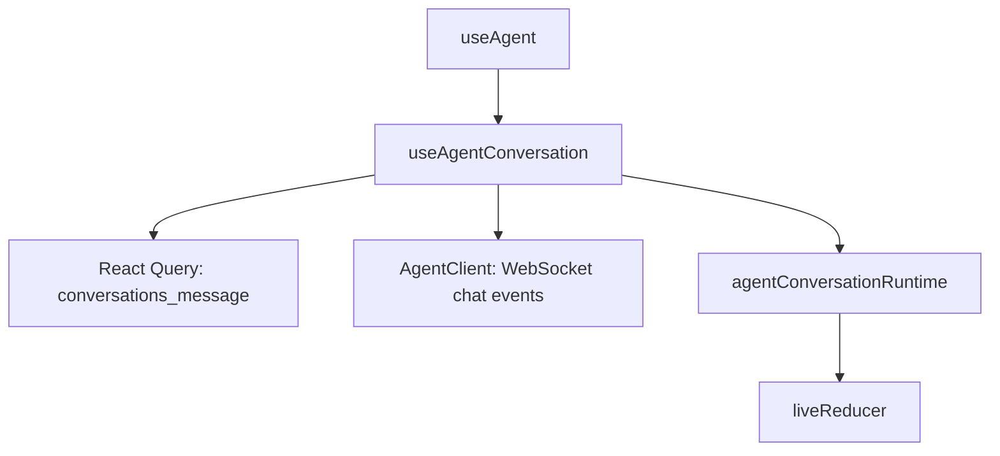
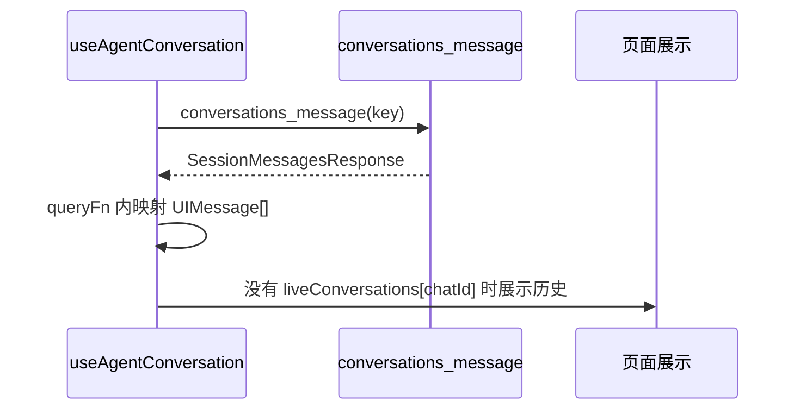
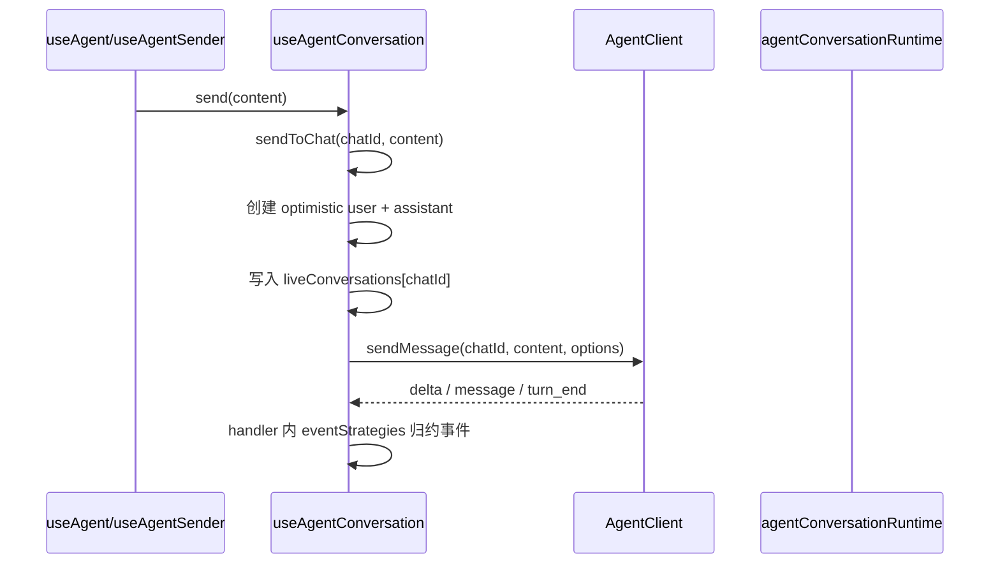
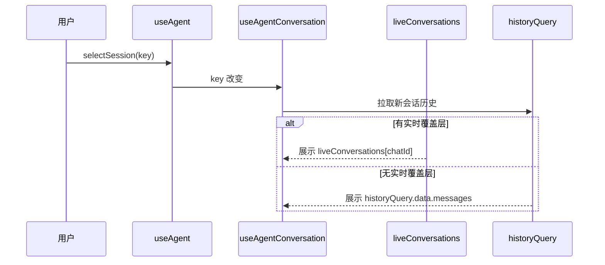
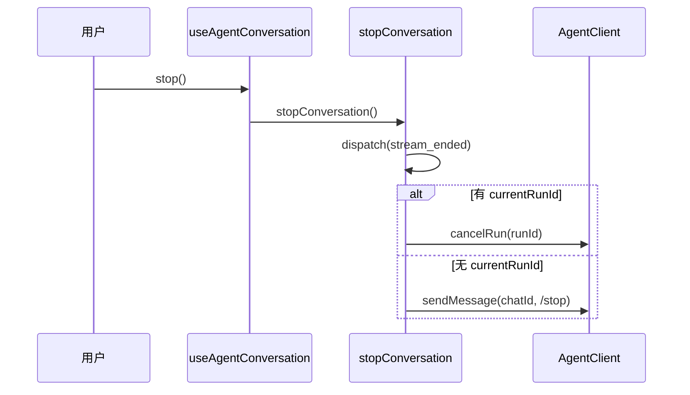
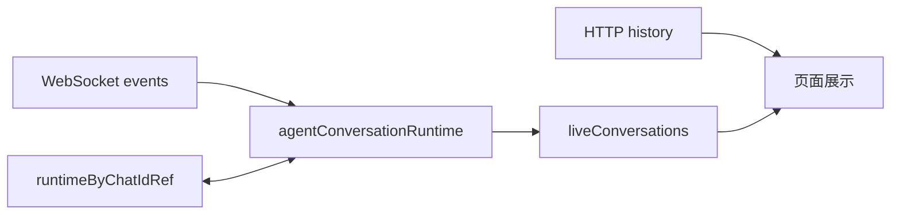

# useAgentConversation 阅读指南

`useAgentConversation` 是聊天详情的状态编排层。它把 HTTP 历史消息、WebSocket 实时事件、发送动作、停止动作、多会话后台流式状态合成页面可直接消费的 `state` 和 `actions`。

文件位置：

- `apps/user-web/src/pages/chat/hooks/useAgentConversation.ts`
- 事件归约逻辑在 `apps/user-web/src/pages/chat/hooks/agentConversationRuntime.ts`
- 上层聚合入口在 `apps/user-web/src/pages/chat/hooks/useAgent.ts`

## 1. 对外接口

输入：

```ts
interface UseAgentConversationOptions {
  client: AgentClient
  key: string | null
  onSessionUpdated?: () => void
  onSessionStreamingChange?: (chatId: string, isStreaming: boolean) => void
}
```

输出：

```ts
{
  state: {
    messages: UIMessage[]
    loading: boolean
    isStreaming: boolean
    hasPendingToolCalls: boolean
  },
  actions: {
    send: (content, options?) => void
    sendToChat: (targetChatId, content, options?) => void
    stop: () => void
  }
}
```

上层 `useAgent` 只关心这些返回值：

- `messages` 渲染气泡列表
- `loading` 控制详情加载态
- `isStreaming` 控制输入框禁用和停止按钮
- `send / sendToChat / stop` 承接发送和停止动作

后台会话的流式状态通过 `onSessionStreamingChange` 直接写入 `useAgentSessions` 的 sessions 数据源。

## 2. 职责边界



`useAgentConversation` 负责会话详情状态，`AgentClient` 负责协议连接和事件分发，`agentConversationRuntime` 负责把协议事件归约成消息状态。

这层的核心职责有四个：

1. 根据 `key` 拉取当前会话历史。
2. 订阅当前会话和后台流式会话的 WebSocket 事件。
3. 用 `liveConversations` 管理所有实时会话内容。
4. 发送消息时立即插入 optimistic user + assistant 占位。

## 3. 内部状态

### `historyQuery`

```ts
useQuery({
  queryKey: conversationKeys.messages(key),
  queryFn: ...
})
```

服务端历史消息来源。当前会话没有实时覆盖层时，页面直接展示 `historyQuery.data.messages`。

### `liveConversations`

```ts
Record<string, LiveState>
```

唯一实时覆盖层，按 `chatId` 保存所有正在流式或已有 optimistic 内容的会话。当前会话和后台会话都写入这里。

### `liveConversationsRef`

```ts
const liveConversationsRef = useRef<LiveConversationsState>(liveConversations)
```

WebSocket 回调读取最新实时覆盖层，避免闭包读到旧状态。

### `runtimeByChatIdRef`

```ts
Map<string, ConversationRuntime>
```

按 `chatId` 缓存运行时信息：

```ts
interface ConversationRuntime {
  buffer: { messageId: string; parts: string[] } | null
  currentRunId: string | null
}
```

- `buffer` 保存当前 assistant 流式消息的 id 和文本片段。
- `currentRunId` 用于停止时发送 cancel。

### `chatSubscriptionRef`

记录每个 `chatId` 的 WebSocket 取消订阅函数。会话仍在 streaming 时保留订阅，结束后释放后台订阅。

## 4. 历史消息加载



历史消息映射做三件事：

1. 只保留 `user` 和 `assistant` 消息。
2. 把服务端消息映射成统一的 `UIMessage`。
3. 根据最后一条 assistant 的 `tool_calls` 计算 `hasPendingToolCalls`。

历史消息 id 使用 `hist-` 前缀，本地实时消息 id 使用 `msg-` 前缀。上层 `useAgent` 根据这个前缀判断历史 assistant 消息是否启用打字机效果。

## 5. 发送消息流程



`sendToChat` 的关键动作：

1. 校验文本、图片、附件，空提交直接返回。
2. 从 `liveConversations[chatId]` 或当前历史取出基础消息。
3. 创建一条 user 消息和一条空 assistant streaming 占位消息。
4. 确保目标会话已经订阅 WebSocket。
5. 初始化 `runtimeByChatIdRef[chatId].buffer`，把后续 delta 绑定到这条 assistant 占位消息。
6. 写入 `liveConversations[chatId]`。
7. 调用 `client.sendMessage` 发送真实协议帧。

## 6. WebSocket 事件处理

事件入口在 `ensureChatSubscription`：

```ts
client.on('chat', {
  chatId: targetChatId,
  handler: (event) => {
    ...
  },
})
```

路由规则：

```mermaid
flowchart TD
    A[chat event] --> B{eventChatId 有值}
    B -->|有| C{session_updated}
    C -->|是| D[刷新历史和会话列表]
    C -->|否| E[handler 内 eventStrategies]
    E --> F[liveConversations[eventChatId]]
```

当前会话和后台会话事件都在 `client.on('chat')` 的 handler 内按事件类型归约，然后写入 `liveConversations[eventChatId]`。当前页面是否重渲染只取决于当前 `chatId` 是否命中这份实时覆盖层。

## 7. 协议事件到 UIMessage 的映射

核心逻辑在 `agentConversationRuntime.ts`。

| 事件 | 处理结果 |
| --- | --- |
| `attached` | 忽略，订阅确认由 `AgentClient` 处理 |
| `delta` | 追加到 `runtime.buffer.parts`，更新同一条 assistant streaming 消息 |
| `stream_end` | 清空 buffer，本轮 streaming 状态继续等待 `turn_end` |
| `turn_end` | 清理 run 和 buffer，所有 streaming 消息收口 |
| `canceled` | 清理运行时，追加一条取消 trace |
| `error` | 清理运行时并结束 streaming |
| `message` | 有媒体或按钮时创建结构化 assistant 消息 |

`delta` 是正文流式输出来源。普通纯文本 `message` 作为协议兼容帧被过滤，媒体和按钮类 `message` 会追加成结构化消息。

## 8. 切换会话流程



切换会话不再保存和恢复快照。页面始终按同一个优先级取数据：`liveConversations[chatId]` 优先，`historyQuery` 兜底。

这个设计保证三类场景都能成立：

- 从 A 切到 B，再切回 A，A 的本地流式状态还在。
- B 后台仍在回复，事件继续进入 B 的实时覆盖层。
- 新建会话首条消息发送后，正式 `chatId` 出现时仍能保住 optimistic 消息。

## 9. 新建会话首条消息

上层 `useAgent` 在草稿态发送时先创建 chat：

```ts
const createdChatId = await createActiveChat()
sendToChat(createdChatId, content, options)
```

`sendToChat` 会直接把 optimistic 消息写入 `liveConversations[chatId]`。页面切到 `websocket:${chatId}` 后，展示层自然命中这份实时覆盖层。

这段逻辑解决的是“新建会话时 key 先为空，发送后 key 变成正式会话”的过渡问题。

## 10. 停止流程



停止时先本地收口 streaming，再通知服务端。已有 `run_id` 时发送 `cancel`，缺少 `run_id` 时发送 `/stop` 作为兜底指令。

## 11. session_updated 的意义

`session_updated` 表示服务端会话数据已经更新。hook 收到后会：

1. 在没有实时内容时清理对应实时覆盖层。
2. invalidate 当前会话的历史消息 query。
3. 调用 `onSessionUpdated`，让上层刷新会话列表。

这里同时影响详情和列表：

- 详情通过 `conversationKeys.messages(sessionKey)` 重新拉历史。
- 列表通过 `useAgentSessions.refresh()` 更新标题、排序和元数据。

## 12. 阅读顺序

建议按这个顺序读：

1. `UseAgentConversationOptions` 和返回值，先确认输入输出。
2. `historyQuery.queryFn`，理解历史消息如何变成 `UIMessage`。
3. `sendToChat`，理解 optimistic UI 和真实发送。
4. `ensureChatSubscription`，理解事件如何写入 `liveConversations`。
5. `commitLiveConversation`，理解实时覆盖层如何触发页面和 sessions 更新。
6. `agentConversationRuntime.ts`，理解每种协议事件如何改变消息。

## 13. 修改时重点检查

改这个 hook 时优先验证这些场景：

1. 普通会话发送一条文本消息，delta 能更新同一条 assistant 占位消息。
2. `turn_end` 后输入框恢复可用，assistant 消息的 `isStreaming` 清空。
3. 会话 A 正在回复时切到会话 B，A 在列表中保持 streaming 标记。
4. A 后台回复完成后再切回 A，消息内容完整。
5. 新建会话首条消息发送后，页面切到正式会话，optimistic 消息保留。
6. `session_updated` 后会话列表刷新，详情保留正在显示的 live 消息。
7. 停止回复时本地立刻收口，服务端确认后追加取消痕迹。

## 14. 记忆模型

可以把它记成两层：



`historyQuery` 是持久化历史来源，`liveConversations` 是唯一实时覆盖层。页面展示时实时覆盖层优先，缺省时回到历史数据。
